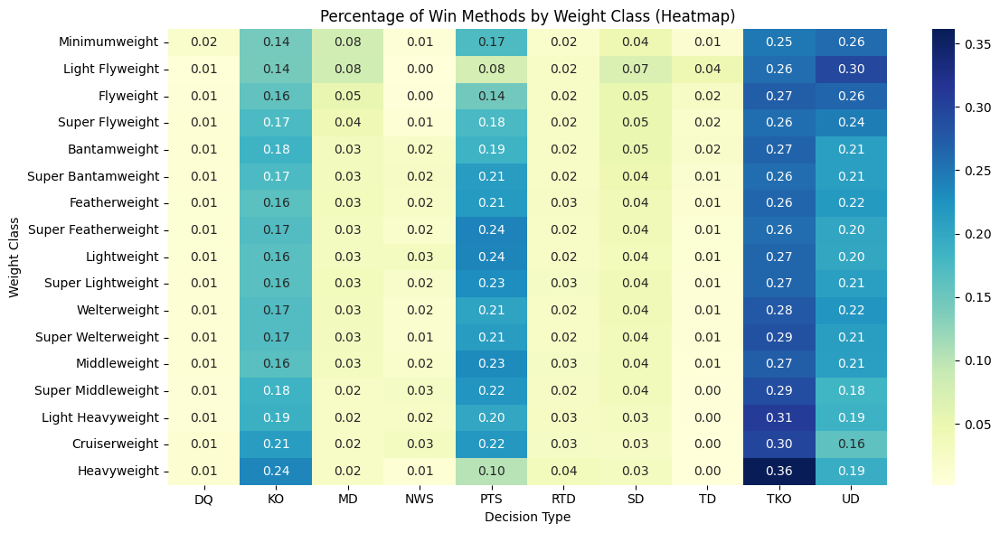
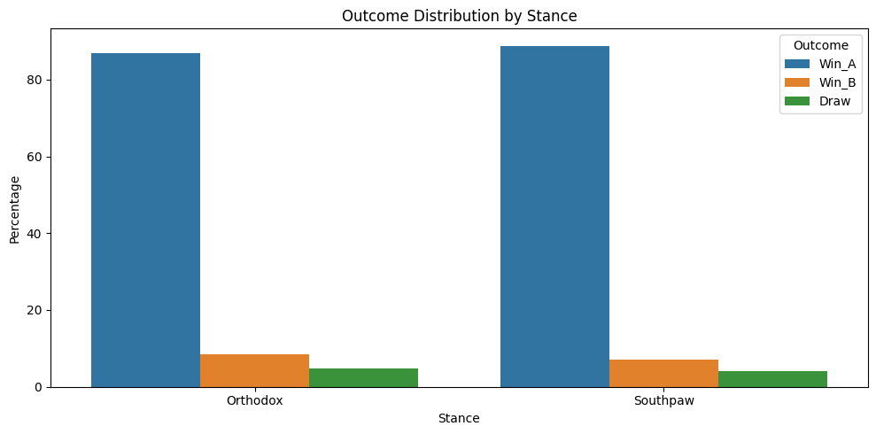
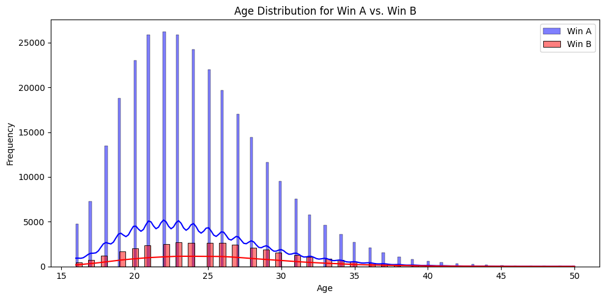

# The-Anatomy-of-A-Win

## Introduction & Goal

This project performs an exploratory data analysis on a comprehensive dataset of professional boxing matches sourced from Kaggle, containing records for approximately 387,000 bouts. The primary objective was to uncover patterns and relationships between fight outcomes and various fighter attributes, such as weight class, decision method, stance, and age. This analysis aimed to answer questions like: How do win methods vary across weight divisions? Does a fighter's stance influence their likelihood of winning? What role does age play in boxing success? By exploring these key factors, the project seeks to provide insights into the dynamics of professional boxing and understand factors related to fight outcomes.

## Data Source & Tools

* **Data Source:** Boxing Matches dataset on Kaggle: [https://www.kaggle.com/datasets/mexwell/boxing-matches](https://www.kaggle.com/datasets/mexwell/boxing-matches)
* **Tools Used:**
    * Python
    * Pandas
    * NumPy
    * Matplotlib
    * Seaborn
    * Google Colab

## Process & Cleaning

Upon initial exploration, the raw dataset revealed potential data quality issues, including significant outliers in physical attributes like age, height, weight, and reach, as well as substantial missing values, particularly for fighter stance. To prepare the data for reliable analysis, these issues were addressed through a series of cleaning steps. Outliers in numerical features were handled by capping values to fall within realistic ranges, ensuring that extreme or erroneous values did not unduly influence the analysis. For example, age values were capped between 16 and 50 years. Missing stance information was handled by filtering out rows lacking stance data specifically for the stance-outcome comparison, ensuring that this analysis was based only on known values. A key step involved creating a categorical 'weight_class' feature based on standard boxing divisions, using the cleaned fighter weight data to categorize fighters into relevant weight groups. While an attempt was made to analyze location trends, relevant geographical data was not present in this dataset.

## Key Findings

This analysis explored a dataset of boxing matches to identify trends and relationships between fighter attributes and fight outcomes. Three key findings emerged:

### Finding 1: Win Methods Vary Significantly by Weight Class

Heavier weight classes exhibited a higher prevalence of stoppages (e.g., TKO, KO) as the primary win method, while lighter and middleweight classes showed a greater reliance on decisions (e.g., UD, PTS).

 
[Heatmap visualizing win method percentages across boxing weight classes]

The heatmap above visualizes this trend, showing higher percentages (darker colors) for TKO and KO in divisions like Heavyweight and Cruiserweight. This likely reflects the increased power potential in these classes leading to more conclusive finishes. Conversely, Unanimous Decisions (UD) and Points (PTS) decisions form a larger share of outcomes in divisions from Welterweight down, suggesting these fights more frequently go the distance, possibly indicating more tactical battles or relatively smaller power differences requiring judges' scoring.

### Finding 2: Stance Shows Little Impact on Outcome Distribution (Caveats Apply)

While stance (Orthodox vs. Southpaw) is often considered a significant factor, this analysis revealed minimal difference in the outcome distribution based on Fighter A's stance within this dataset.

![Grouped bar chart comparing outcome distribution percentages for Orthodox vs Southpaw stances (Fighter A)]

As the bar chart illustrates, both Orthodox and Southpaw stances for Fighter A resulted in very similar outcome percentages (approx. 87-89% Win A, 7-8% Win B, 4-5% Draw). While this suggests stance alone had minimal impact *in this view*, this finding must be interpreted with caution. The dataset exhibits a strong skew towards 'Win_A' results overall (~83%), which likely overshadows subtle stance effects and heavily influences these observed percentages. Therefore, while other factors like skill are undoubtedly crucial, this analysis cannot definitively conclude on stance impact due to the underlying data structure and potential biases in how fighters were listed.

### Finding 3: Winners Tend to Be Slightly Younger

Analysis of fighter age indicated a trend where winners (specifically Fighter A in this analysis) were, on average, slightly younger than their opponents (represented by Fighter A's age when Fighter B wins).

![Overlapping density plots comparing age distribution of Fighter A when winning vs losing]

The overlapping density plots show that the age distribution for Fighter A when winning (blue) peaks slightly earlier (early 20s) compared to when Fighter B wins (red peak slightly later). This aligns with the calculated average ages and suggests a potential advantage for fighters in their physical prime (early-to-mid 20s being a peak activity period). However, the significant overlap and presence of older fighters in both distributions highlight that while youth may offer an edge, experience remains a key factor, indicating a complex interplay between age, athleticism, and experience.

## Limitations

A primary limitation of this analysis was the dataset's significant skew towards 'Win_A' outcomes, potentially influencing comparative analyses, particularly the evaluation of stance and age, and requiring cautious interpretation of results comparing Fighter A and Fighter B. Additionally, the absence of geographical data prevented the exploration of location-based trends in fight outcomes. While strategies were employed to mitigate these limitations (like outlier capping and filtering for specific analyses), it's crucial to acknowledge their potential impact on the findings.

## Conclusion

In conclusion, this analysis of a large boxing dataset highlighted several factors associated with match outcomes. Notably, win methods exhibited a clear dependency on weight class, with stoppages (KOs/TKOs) being more prevalent in heavier divisions while decisions were more common in lighter weight categories. While a definitive relationship between fighter stance and outcome remained inconclusive due to dataset limitations, particularly the skew towards Fighter A wins, the data suggested a tendency for winners to be slightly younger, with a peak performance period in the early-to-mid 20s. These findings offer valuable insights into the complex dynamics influencing professional boxing results, underscoring the interplay of physical attributes like weight and age, while also highlighting areas for further investigation with more balanced datasets.

## Code

The full analysis code and detailed steps can be found in the Jupyter Notebook file in this repository:
[`The_Anatomy_of_a_Win.ipynb`](The_Anatomy_of_a_Win.ipynb)
